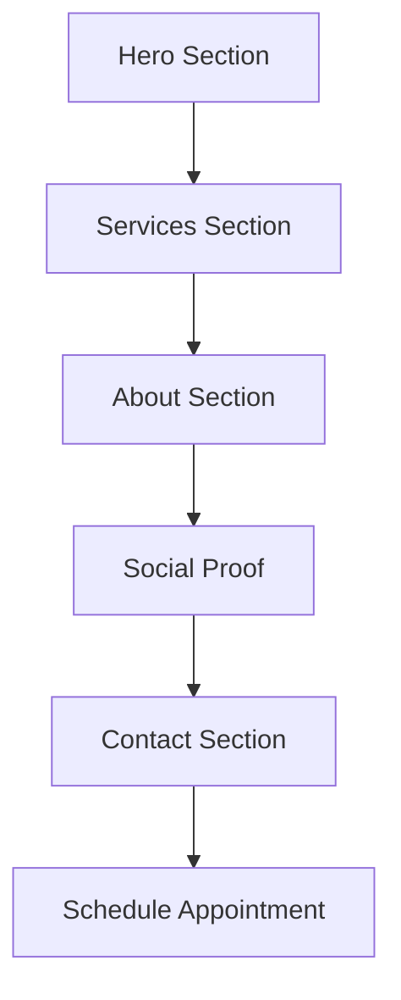

## 1. Product Overview
Landing Page BRIVVA Odontologia - Converter visitantes em agendamentos de consultas, transmitindo confiança e profissionalismo.
Público-alvo: Pacientes que buscam tratamentos odontológicos especializados (implantes, estética, ortodontia).

## 2. Core Features

### 2.1 User Roles
| Role | Registration Method | Core Permissions |
|------|---------------------|------------------|
| Visitor | No registration required | Browse all content, view services, contact clinic |

### 2.2 Feature Module
Landing page requirements consist of the following main sections:
1. **Hero Section**: High-quality image, value proposition, main CTA button.
2. **Services Section**: Grid with specialties (Implants, Orthodontics, Aesthetics).
3. **About Section**: Clinic history and humanized care focus.
4. **Social Proof**: Patient testimonials carousel.
5. **Contact/Location**: Map, address, phone and simple contact form.

### 2.3 Page Details
| Page Name | Module Name | Feature description |
|-----------|-------------|---------------------|
| Landing Page | Header | Fixed navigation with BRIVVA logo, menu items (Home, Services, About, Contact), prominent "Schedule Now" button. |
| Landing Page | Hero Section | High-quality dental image, H1 title "Your Smile Deserves the Best Specialized Care", subtitle about advanced technology, main CTA "Schedule Your Assessment". |
| Landing Page | Services Grid | White cards with soft shadows, linear icons in light blue (#7aa6cb), list specialties: Implants, Orthodontics, Dental Aesthetics, General Clinic. |
| Landing Page | About/Trust Section | Off-white background (#f6f5f5), highlight clinic experience and technology, trust badges for certified professionals and cutting-edge technology. |
| Landing Page | Social Proof | Patient testimonials carousel with star ratings in dark blue (#155184). |
| Landing Page | Contact Section | Map integration, clinic address, phone number, WhatsApp contact, simple contact form. |
| Landing Page | Footer | Dark blue background (#155184) with white text, address, phone, quick links, social media links. |

## 3. Core Process
Visitor Flow: Homepage → View Services → Read About Section → Check Testimonials → Contact Clinic → Schedule Appointment

## 4. User Interface Design

### 4.1 Design Style
- Primary Color: #155184 (Dark Blue) - Headers, main CTAs, footer
- Secondary Color: #7aa6cb (Light Blue) - Secondary buttons, icons
- Text Color: #403f3f (Dark Gray) - Body text
- Background Colors: #f6f5f5 (Off-White) for sections, #ffffff (White) for cards
- Typography: Modern Sans-serif (Inter or Roboto)
- Button Style: Rounded corners with subtle hover effects
- Layout Style: Card-based sections, clean and professional

### 4.2 Page Design Overview
| Page Name | Module Name | UI Elements |
|-----------|-------------|-------------|
| Landing Page | Header | Dark blue (#155184) CTA button with white text, clean navigation menu |
| Landing Page | Hero Section | Split layout - text left, image right, bold H1 in dark blue, prominent CTA button |
| Landing Page | Services Grid | 4-column grid on desktop, white cards with soft shadows, light blue icons |
| Landing Page | About Section | Off-white background, trust badges with icons, professional imagery |
| Landing Page | Social Proof | Testimonial cards with star ratings, patient photos, carousel navigation |
| Landing Page | Contact Section | Embedded map, contact form with clean fields, WhatsApp integration button |
| Landing Page | Footer | Dark blue background, white text, organized link sections |

### 4.3 Responsiveness
Mobile-first design approach with responsive breakpoints. Touch interaction optimization for mobile devices. Services grid adapts from 4 columns on desktop to 2 columns on tablet to 1 column on mobile.