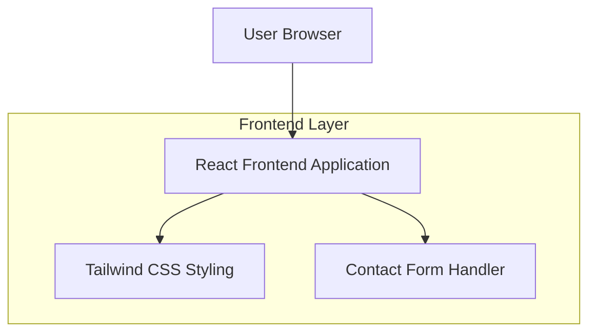

## 1. Architecture design

## 2. Technology Description
- Frontend: React@18 + tailwindcss@3 + vite
- Initialization Tool: vite-init
- Backend: None (Static landing page with client-side contact form)

## 3. Route definitions
| Route | Purpose |
|-------|---------|
| / | Landing page with all sections (Hero, Services, About, Testimonials, Contact) |

## 4. API definitions
No backend API required. Contact form will use client-side email integration or third-party form service.

## 5. Server architecture diagram
Not applicable - this is a static landing page without server-side components.

## 6. Data model
Not applicable - no database required for static landing page.